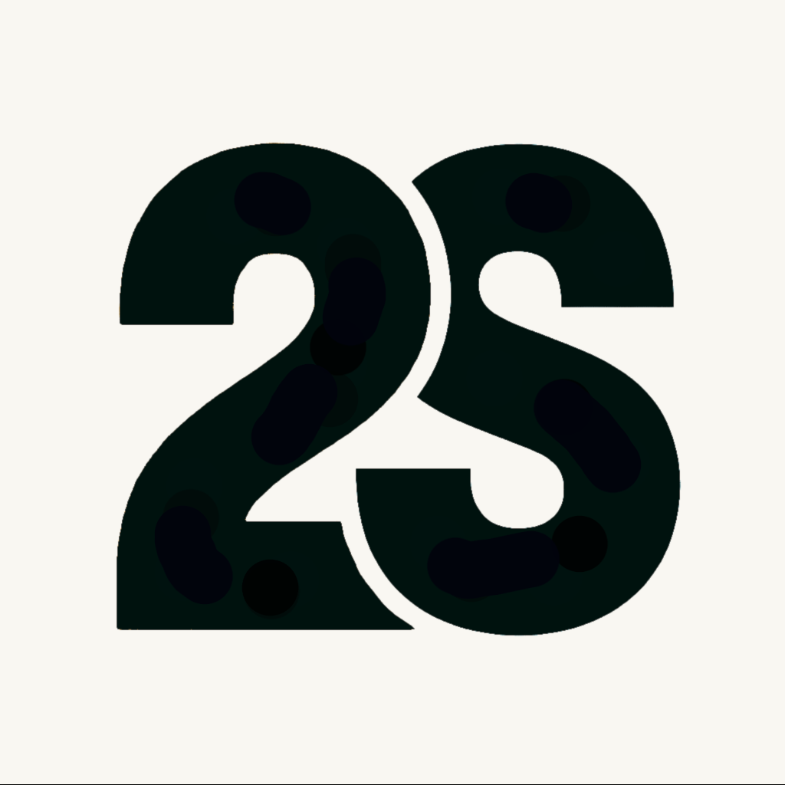
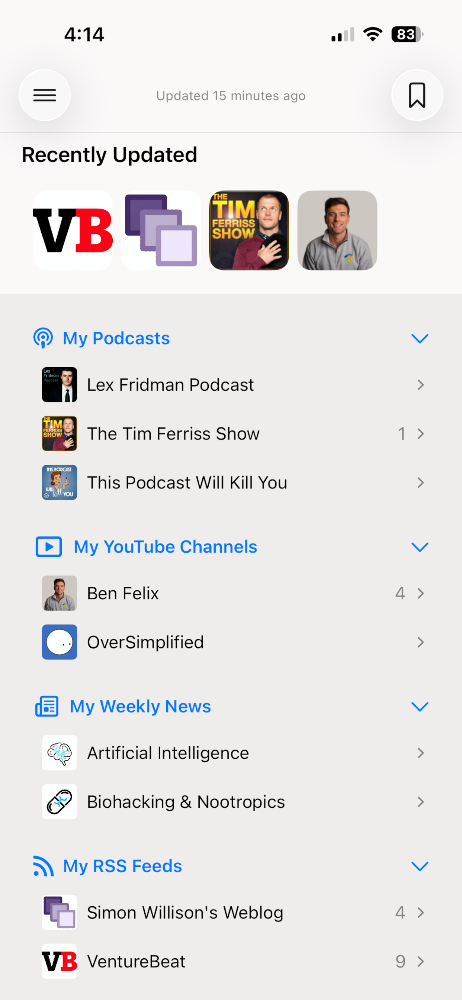
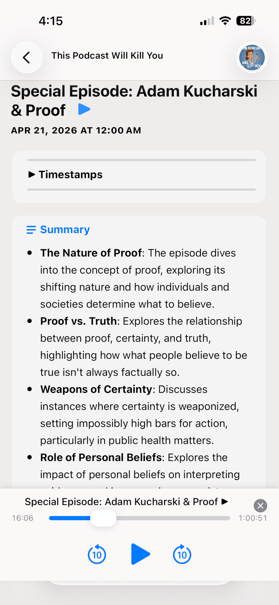
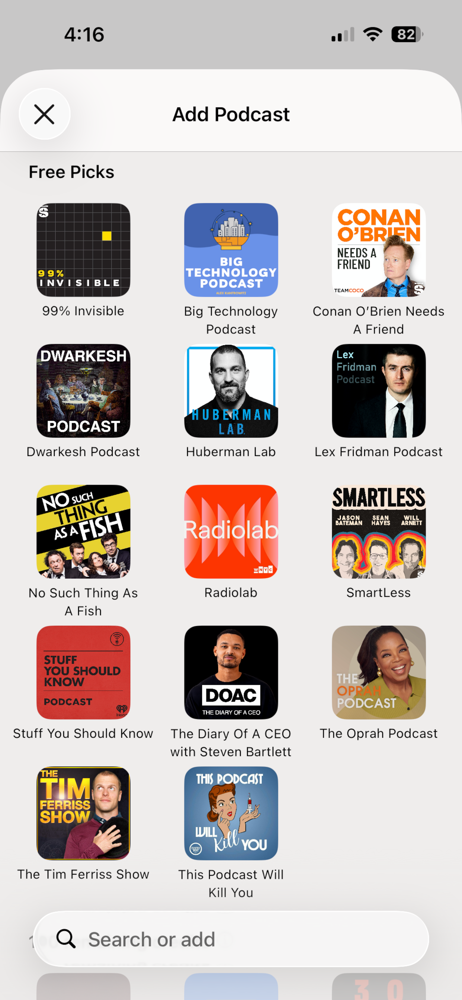
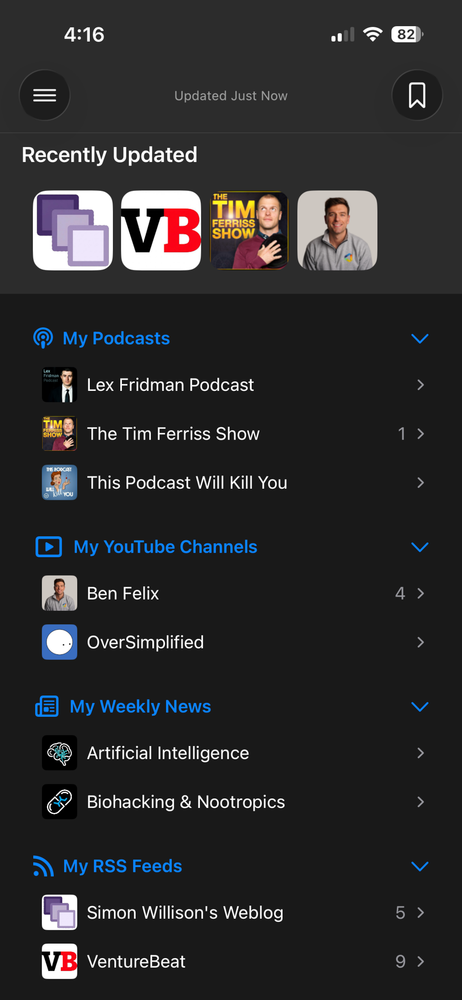

  

<h1 align="center">Second Stream</h1>

<b>Your content, one stream.</b>

  <a href="https://apps.apple.com/ca/app/second-stream/id6760979035">Download on the App Store</a>

  
  
  
  

Second Stream is an iOS feed reader that aggregates podcasts, YouTube channels, RSS/Atom feeds, and curated weekly news digests into a single timeline — with AI-generated summaries so you can decide what's worth your time before you press play.

It's a heavily customized, iOS-only fork of [NetNewsWire](https://github.com/Ranchero-Software/NetNewsWire), rebuilt around a private backend for account sync, source discovery, and AI summarization.

## Features

- **Podcasts, YouTube, and RSS/Atom** — follow anything with a feed URL, or any YouTube channel, in one place
- **AI summaries** — every podcast episode and YouTube video gets a summary so you can skim before you commit
- **Curated weekly news** — configure topics you care about and get an AI-filtered digest each week
- **Smart feeds** — Today, Unread, and Bookmarks, built automatically from what you follow
- **Obsidian vault sync** — bookmarked articles flow straight into your Obsidian PKM vault
- **Face ID & Sign in with Apple** — private by design
- **Background refresh** — content updates even when the app isn't open
- **Light & dark mode** — follows the system appearance
- **Free**, with an optional tip jar

## Structure

- `iOS/` — app target (views, controllers, storyboards)
- `Shared/` — code shared across the app (API client, auth, sources, settings)
- `Modules/` — local Swift packages (Account, Articles, ArticlesDatabase, RSCore, RSParser, RSWeb, RSDatabase, RSTree, Secrets, SyncDatabase, FeedFinder)
- `www/` — marketing site and App Store screenshots

## Building

Open `SecondStream.xcodeproj` in Xcode and build the `SecondStream-iOS` scheme. Two bundled, gitignored text files are required at build time (not included in this repo, since the app talks to a private backend):

- `Shared/PodcastSources/podcast_token.txt` — bootstrap API token
- `Shared/API/webhook_base_url.txt` — base URL for the backend webhooks

## License

MIT — see [LICENSE](LICENSE). Original copyright (c) 2002-2025 Brent Simmons.
